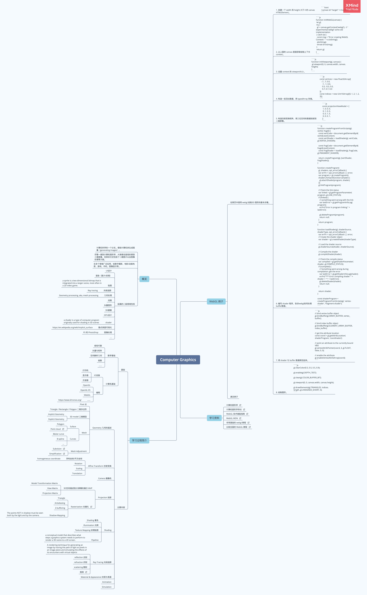

# WebGL

[WebGL](https://developer.mozilla.org/en-US/docs/Web/API/WebGL_API/Tutorial) is amazing! Learn something in the Graphics Library.

Maybe some practices, and collections on data visualization or web gaming.

You'd better check the API usage while developing, how can you memorize all the drawing functions?

# The list

- **[WebGL tutorialspoint]**(webgl-tutorialspoint/README.md): A much detailed WebGL learning notes!

  [WebGL Basics](https://blogoben.wordpress.com/2011/02/20/webgl-comes/): A good blog on WebGL basic concepts, though it hasn't been updated for a long time.

  [OpenGL Basic](http://www.songho.ca/opengl/index.html): A fundamental information blog on OpenGL, but the concepts are similar.

- **[WebGL MDN](https://developer.mozilla.org/en-US/docs/Web/API/WebGL_API/Tutorial/Getting_started_with_WebGL)**: Official RFC.

- **[WebGL Fundamentals](https://webglfundamentals.org/)**: Amazing collection of articles that teach WebGL from ground up.

- [Ray Tracer](raytracer/README.md): A small project with self-implemented ray tracing to render image offline.

- [Three Js](three/README.md)

- [SVG](svg/README.md)

- **[Canvas](https://akatquas.github.io/view/canvasDemos/index.html)**: Draw on canvas in vanilla way.

- **[D3 in Depth](https://d3indepth.com/)**: Tutorial and Document on D3.

- [Computer Graphics Beginner](./ComputerGraphicsBeginner.xmind): An xmind file listing some basic concepts for computer graphics learning for beginners.

  > 
