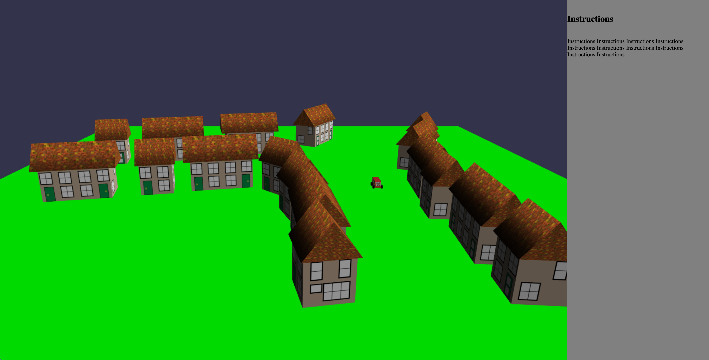

# Babylon.js

## Development

Using [http-server](https://github.com/http-party/http-server) to serve static files.

## Examples

Plain cube demo

`./demo.sh first`

Village

`./demo.sh village`

Hanabi capucat

[`./festival`](./festival)

