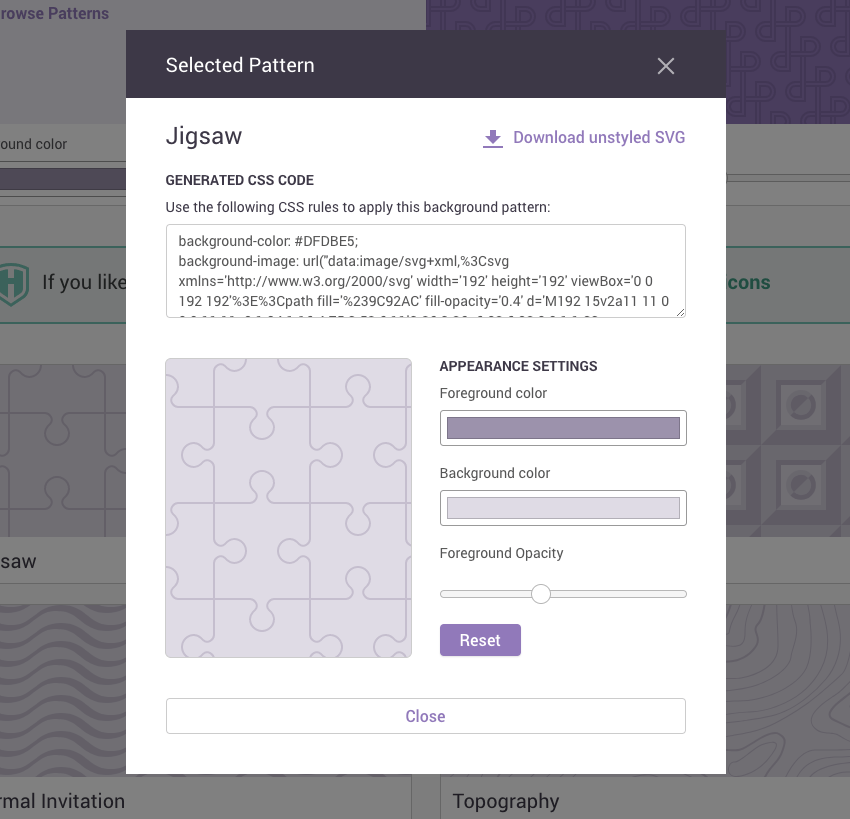

# A play on SVG

Read several posts on handmade SVG.

[SVG on MDN](https://developer.mozilla.org/en-US/docs/Web/SVG)

## Hand Code SVG

The original document, [Hand Code SVG](https://webdesign.tutsplus.com/tutorials/how-to-hand-code-svg--cms-30368): Learn to draw an SVG by hand without open a graphics application.

### Basic SVG Elements

The full list of SVG elements can be found on [MDN](https://developer.mozilla.org/en-US/docs/Web/SVG/Element), and the [available attributes](https://developer.mozilla.org/en-US/docs/Web/SVG/Attribute).

- `<svg>`: Wraps and defines the entire graphic. `<svg>` is to a scalable vector graphic what the `<html>` element is to a web page.

- `<line>`: Makes single straight lines.

- `<circle>`: Makes single circles.

- `<polyline>`: Makes multi-segment lines.

- `<rect>`: Makes rectangles and squares.

- `<ellipse>`: Makes circles and ovals.

- `<polygon>`: Makes straight sided shapes, with three sides or more.

- `<path>`: Makes any shape you like by defining points and the lines between them.

- `<defs>`: Defines reusable assets. Nothing placed inside this `<defs>` section is visible initially. `<defs>` is to a scalable vector graphic what the `<head>` element is to a web page.

- `<g>`: Wraps multiple shapes into a group. Place groups in the `<defs>` section to enable them to be reused.

- `<symbol>`: Like a group, but with some extra features. Typically placed in the `<defs>` section.

- `<use>`: Takes assets defined in the `<defs>` section and makes them visible in the SVG.

---

In the `<line>`, you have 4 attributes to use: `x1`, `y1`, `x2`, `y2`.

- `x1`: horizontal starting point of the line
- `y1`: vertical starting point of the line
- `x2`: horizontal ending point of the line
- `y2`: vertical ending point of the line

```html
<line x1="0" y1="0" x2="100" y2="100"></line>
<line x1="0" y1="0" x2="0" y2="100"></line>
<line x1="0" y1="0" x2="100" y2="0"></line>
<line x1="50" y1="0" x2="50" y2="100"></line>
```

In the `<circle>` element, there is 3 attributes: `r`, `cx`, `cy`.

- `r`: required, radius of the circle.
- `cx`: optional, the center position on the `x` axis.
- `cy`: optional, the center position on the `y` axis.

```html
<circle fill="#bee9e8" cx="50" cy="50" r="25"> </circle>
```

In the `<polyline>` element, there is only one attribute: `points`. 

```html
<polyline points="
    20 30
    90 100
    20 180
    40 280
    50 180
"></polyline>

<polyline points=" 0 100, 80 180, 100 150 "></polyline>

<polyline points=" 0 100 80 180 100 150 "></polyline>
```

In the `<rect>`, there are 4 attributes: `x`, `y`, `width`, `height`.

- `x`: the top left corner position on the `x` axis
- `y`: the top left corner position on the `y` axis
- `width`: width of the shape
- `height`: height of the shape


You can also use the attributes `rx` and `ry` to create rounded corners.

```html
<rect x="10" y="300" width="100" height="80" rx="10" ry="10"></rect>
``` 

In the `<ellipse>`, you have 4 attributes: `cx`, `cy`, `rx`, `ry`.

- `cx`: the center position on the `x` axis. Think “cx for center x”.
- `cy`: the center position on the `y` axis. Think “cy for center y”.
- `rx`: the size of the radius on the `x` axis, i.e. the shape’s height divided in half. Think “rx for radius x”.
- `ry`: the size of the radius on the `y` axis, i.e. the shape’s width divided in half. Think “ry for radius y”.

```html
<ellipse cx="150" cy="140" rx="3" ry="3" stroke-width="6"></ellipse>
<ellipse cx="150" cy="120" rx="40" ry="40"></ellipse>
```

In the `<polygon>`, you have the same attributes `points` just like `<polyline>`, but `<polygon>` would close itself while `<polyline>` remains open.

```html
<polygon points="175 240, 135 260, 135 220"></polygon>
```

In the `<path>`, it's similar to a polygon, where you lay out the shape a piece at a time. However with a path you directly create each point and line yourself without automation, and you also have the option to create curves between points instead of straight lines.

There's only one of the attributes of `<path>`, and that is `d`, which stands for "data". You define all the points and lines of the path in here. Within this attribute, commands to set the points of a path and create lines between them are provided via single letters such as `M` or `L`, followed by a set of `x` and / or `y` coordinates.

There are several of these commands, but to give you an intro to working with `<path>` we’ll stick to a few that can be realistically used when hand coding. They are as follows:

- `M` Represents **moveto**. It starts a new path at a given position, defined with `x` and `y` values. Imagine this is like hovering your mouse over a point on your canvas, ready to draw. The capital `M` indicates moving to an absolute set of coordinates.

- `L` Represents **lineto**. Draw a line from the current position to a new position. The capital `L` indicates moving to an absolute set of coordinates.

- `Z` Represents **closepath**. It converts the path into a closed shape by drawing a straight line between the current point to the first point created in the path.

- `H` Represents **horizontal lineto**. 

- `L` Represents **vertical lineto**.

- `C` Represents **curveto**.

- `S` Represents **smooth curveto**.

- `Q` Represents **quadratic Belzier curveto**.

- `T` Represents **smooth quadratic Belzier curveto**.

- `A` Represents **elliptical Arc**.

Among the above commands, UPPER CASE indicates absolute coordinates while lower case would indicate relative coordinates).

```html
<path d="M153 334
    C153 334 151 334 151 334
    C151 339 153 344 156 344
    C164 344 171 339 171 334
    C171 322 164 314 156 314
    C142 314 131 322 131 334
    C131 350 142 364 156 364
    C175 364 191 350 191 334
    C191 311 175 294 156 294
    C131 294 111 311 111 334
    C111 361 131 384 156 384
    C186 384 211 361 211 334
    C211 300 186 274 156 274"
    style="fill:white;stroke:red;stroke-width:2px"/>

<path d="M140 2
    L 160 2
    L 160 52
    L 175 52
    L 150 77
    L 125 52
    L 140 52
    Z" />
    
<path d="M200 2
    l 20 0
    l 0 50
    l 15 0
    l -25 30
    l -25 -30
    l 15 0
    Z" />
```

To reuse tho element we use `<defs>`.

This tells the system that all the icons we’ve made are to be hidden by default, until we explicitly use them.

To create groups we use `<g>`.

There are two ways we can make our icons ready for use: by converting them to groups, or into symbols. We’ll turn the first half of the icons into groups, and the second half into symbols so we can illustrate the difference.

```html
<defs>
    <g id="leftalign">
        <!-- Left align icon made with lines -->
        <line x1="303" y1="3" x2="348" y2="3"></line>
        <line x1="303" y1="19" x2="365" y2="19"></line>
        <line x1="303" y1="35" x2="348" y2="35"></line>
        <line x1="303" y1="51" x2="365" y2="51"></line>
    </g>

    <g id="rightcaret">
        <!-- Right caret icon made with a polyline -->
        <polyline points="
          403 3
          430 28
          403 53
        "></polyline>
    </g>

    <g id="browser">
        <!-- Browser icon made with rectangle and lines -->
        <rect x="403" y="3" width="80" height="60"></rect>
        <line x1="403" y1="19" x2="483" y2="19"></line>
        <line x1="420" y1="3" x2="420" y2="17"></line>
    </g>

</defs>
```

After groups defined in `<defs>`, we can now use them in the SVG using `<use>`.

```html
<use href="#leftalign" x="300" y="10"></use>
        
<use href="#rightcaret" x="300" y="100"></use>

<use href="#browser" x="500" y="100"></use>
```

And we are going to use `<symbols>` instead of `<g>`.

However what we’re also going to add is a [viewBox attribute](https://webdesign.tutsplus.com/tutorials/svg-viewport-and-viewbox-for-beginners--cms-30844). This will let us define what the visible portion of each symbol should be. When the browser has access to this information it can then scale and align symbols correctly.


```html
<defs>
    <symbol id="alert" viewBox="0 0 86 86">
        <!-- Alert icon made with ellipses and a line -->
        <ellipse cx="43" cy="43" rx="40" ry="40"></ellipse>
        <ellipse style="fill:black;" cx="43" cy="65" rx="5" ry="5"></ellipse>
        <line style="stroke-width: 8px;" x1="43" y1="19" x2="43" y2="48"></line>
    </symbol>


    <symbol id="play" viewBox="0 0 86 86">
        <!-- Play icon made with ellipse and polygon -->
        <ellipse cx="43" cy="43" rx="40" ry="40"></ellipse>
        <polygon points="35 23, 60 43, 35 63"/>
    </symbol>

    <symbol id="download" viewBox="0 0 64 71">
        <!-- Download icon made with path -->
        <path d="
          M 18 3
          L 46 3
          L 46 40
          L 61 40
          L 32 68
          L 3 40
          L 18 40
          Z
        "></path>
    </symbol>
</defs>
```

> It seems you don't have to wrap the `<symbol>` in `<defs>`, but it's a good habit to do that for more clear semantic.

We use `<symbol>` via `<use>`, exactly the same way we use groups `<g>`. 

Try applying `width` and `height` attributes to the `<use>` elements of one of your group based icons. You’ll notice that nothing changes. This is because the browser relies on `viewBox` values, (which a group cannot have), in order to know how to scale the icons.

## SVG Viewport and viewBox

What are the viewport and `viewBox` in SVG? This [doc](https://webdesign.tutsplus.com/tutorials/svg-viewport-and-viewbox-for-beginners--cms-30844) provide some points.

Let’s boil everything down into some bullet points:

- The viewport is like a window you look through to see an SVG’s content.

- The `viewBox` is similar to the viewport, but you can also use it to “pan” and “zoom” like a telescope.

- Control the viewport via `width` and `height` parameters on the `svg` element.

- Control the `viewBox` by adding the attribute `viewBox` to the `svg` element. It can also be used on the elements `symbol`, `marker`, `pattern` and `view`.

- The `viewBox` attribute’s value is comprised of four space separated parameters.

- The first two `viewBox` parameters control “panning” and the last two control “zooming”.

- Increase the first parameter to “pan” right, decrease it to “pan” left.

- Increase the second parameter to “pan” down, decrease it to “pan” up.

- Make the `viewBox` dimensions, i.e. the last two parameters, larger than those of the viewport to “zoom out”, and smaller to “zoom in”.

## Use `AnimationTransform` for Inline SVG Animation

[Documentation on MDN](https://developer.mozilla.org/en-US/docs/Web/SVG/SVG_animation_with_SMIL)

In this [post](https://webdesign.tutsplus.com/tutorials/how-to-use-animatetransform-for-inline-svg-animation--cms-22296), we’ll be stepping you through the basics of using `animateTransform` to generate inline animations with SVG.

In short answer, `animateTransform` element generates animations by setting transform properties on the SVG shape to which it's applied. There are five different types of transformation you can perform: `translate`, `scale`, `rotate`, `skewX`, `skewY`.

The basic process has three steps:

- Set an initial state of transformation: the `from` state.
- Set a second state of transformation: the `to` state.
- Set the timing and repetition for an animated transition between the `from` and the `to` state.

```html
<rect id="Rectangle-1" fill="#3C81C1" sketch:type="MSShapeGroup" x="0" y="0" width="100" height="125">
  <animateTransform attributeName="transform"
    type="translate"
    from="0 0"
    to="150 20"
    begin="0s"
    dur="2s"
    repeatCount="indefinite"
  />
</rect>

<animateTransform attributeName="transform"
  type="scale"
  from="1 1"
  to="3 1.25"
  begin="0s"
  dur="2s"
  repeatCount="0"
/>
```

Now what about **Multiple Transformations**? 

We can only use a single `animateTransform` tag inside the `rect` tag, so to use multiple animations we'll need to incorporate a set of `g` tags, which represent a group of SVG objects.

```html
<g>
<rect id="Rectangle-1" fill="#3C81C1" sketch:type="MSShapeGroup" x="0" y="0" width="100" height="125">
  <animateTransform attributeName="transform"
    type="scale"
    from="1 1"
    to="3 1.25"
    begin="0s"
    dur="2s"
    repeatCount="0"
  />
</rect>
<animateTransform attributeName="transform" type="translate" from="0 0" to="150 20" begin="0s" dur="2s" repeatCount="0" />
</g>
```

A rotating loader example.


```html
<svg width="36px" height="36px" viewBox="0 0 36 36" version="1.1" xmlns="http://www.w3.org/2000/svg" xmlns:xlink="http://www.w3.org/1999/xlink" xmlns:sketch="http://www.bohemiancoding.com/sketch/ns">
    <!-- Generator: Sketch 3.1 (8751) - http://www.bohemiancoding.com/sketch -->
    <title>loader01 2</title>
    <desc>Created with Sketch.</desc>
    <defs></defs>
    <g id="Page-1" stroke="none" stroke-width="1" fill="none" fill-rule="evenodd" sketch:type="MSPage">
        <g id="Group-3" sketch:type="MSLayerGroup" fill="#4990E2">
            <rect id="Rectangle-1" sketch:type="MSShapeGroup" x="16.5873418" y="0" width="3" height="9.13705584"></rect>
            <rect id="Rectangle-2" fill-opacity="0.58" sketch:type="MSShapeGroup" x="16.678481" y="26.8629442" width="3" height="9.13705584"></rect>
            <rect id="Rectangle-4" fill-opacity="0.79" sketch:type="MSShapeGroup" transform="translate(31.530380, 17.954315) rotate(-270.000000) translate(-31.530380, -17.954315) " x="30.0303797" y="13.3857868" width="3" height="9.13705584"></rect>
            <rect id="Rectangle-3" fill-opacity="0.37" sketch:type="MSShapeGroup" transform="translate(4.735443, 18.045685) rotate(-270.000000) translate(-4.735443, -18.045685) " x="3.23544304" y="13.4771574" width="3" height="9.13705584"></rect>
            <rect id="Rectangle-4" fill-opacity="0.72" sketch:type="MSShapeGroup" transform="translate(29.758244, 24.676171) rotate(-240.000000) translate(-29.758244, -24.676171) " x="28.2582441" y="20.1076435" width="3" height="9.13705584"></rect>
            <rect id="Rectangle-3" fill-opacity="0.3" sketch:type="MSShapeGroup" transform="translate(6.507579, 11.323829) rotate(-240.000000) translate(-6.507579, -11.323829) " x="5.00757864" y="6.75530065" width="3" height="9.13705584"></rect>
            <rect id="Rectangle-4" fill-opacity="0.65" sketch:type="MSShapeGroup" transform="translate(24.871110, 29.609153) rotate(-210.000000) translate(-24.871110, -29.609153) " x="23.37111" y="25.0406255" width="3" height="9.13705584"></rect>
            <rect id="Rectangle-3" fill-opacity="0.23" sketch:type="MSShapeGroup" transform="translate(11.394713, 6.390847) rotate(-210.000000) translate(-11.394713, -6.390847) " x="9.89471277" y="1.82231869" width="3" height="9.13705584"></rect>
            <rect id="Rectangle-4" fill-opacity="0.51" sketch:type="MSShapeGroup" transform="translate(11.473642, 29.654839) rotate(-150.000000) translate(-11.473642, -29.654839) " x="9.97364166" y="25.0863108" width="3" height="9.13705584"></rect>
            <rect id="Rectangle-3" fill-opacity="0.93" sketch:type="MSShapeGroup" transform="translate(24.792181, 6.345161) rotate(-150.000000) translate(-24.792181, -6.345161) " x="23.2921811" y="1.77663341" width="3" height="9.13705584"></rect>
            <rect id="Rectangle-4" fill-opacity="0.44" sketch:type="MSShapeGroup" transform="translate(6.553148, 24.755301) rotate(-120.000000) translate(-6.553148, -24.755301) " x="5.05314826" y="20.1867727" width="3" height="9.13705584"></rect>
            <rect id="Rectangle-3" fill-opacity="0.86" sketch:type="MSShapeGroup" transform="translate(29.712675, 11.244699) rotate(-120.000000) translate(-29.712675, -11.244699) " x="28.2126745" y="6.67617143" width="3" height="9.13705584"></rect>
        </g>
        <animateTransform repeatCount="indefinite" attributeName="transform" type="rotate" from="0 18 18" to="360 18 18" dur="1.5s" begin="0s" />
    </g>
</svg>
```

## Draw SVG Patterns as Background

A beautiful way to draw a background using SVG, [docs](https://webdesign.tutsplus.com/tutorials/how-to-use-svg-patterns-as-backgrounds--cms-31507).

[Demo code](./bg-pattern/index.html)

```html
<svg width="100%" height="100%">
    <defs>
        <pattern id="polka" x="0" y="0" width="100" height="100" patternUnits="userSpaceOnUse">
            <circle r="25" fill="#bee9e8" cx="50" cy="50"></circle>
        </pattern>
    </defs>
    <rect x="0" y="0" width="100%" height="100%" fill="url(#polka)"></rect>
</svg>
```

We can find more SVG patterns at [heropatterns.com](http://www.heropatterns.com/), [SVG Patterns Gallery](https://philiprogers.com/svgpatterns/), [Geopattern, A funny playground](http://btmills.github.io/geopattern/), [thepatternlibrary.com, much more beautiful patterns](http://thepatternlibrary.com/)



### CSS Tiling Vs. SVG Patterns

😀 CSS tiling pros:

- Easier to use, certainly for beginners
- Enjoys wide browser support

😡 CSS tiling cons:

- When used with bitmaps it isn’t scalable
- Lower performance
- More difficult to customize
- Limited to rectangular repetitions

😀 SVG pattern pros:

- Lightweight
- Customize from CSS
- Scalable
- Able to create complex patterns

😡 SVG pattern cons:

- Relatively difficult to use
- Non-universal browser support
