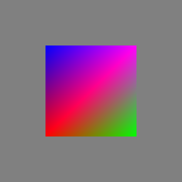

# A simple webgl tutorial

A WebGL tutorial from [**tutorialspoint**](https://www.tutorialspoint.com/webgl/index.htm).

More tutorials or documents can be found at [MDN](https://developer.mozilla.org/en-US/docs/Web/API/WebGL_API/Tutorial/Getting_started_with_WebGL).

# What I Have learned ?

Unless you want to develop on WebGL, you'd better never write the `webgl code` yourself. Using library instead!

# Contents

- [Introduction](docs/introduction.md)

- [Basic](docs/basics.md)

- [Application](docs/application.md)

- [Quick Guides](https://www.tutorialspoint.com/webgl/webgl_quick_guide.htm)

- [WebGL official site](https://www.khronos.org/webgl/)

# Examples

- [test](examples/play-a-test.html)

- [point](examples/point.html)

    
    
- [triangle](examples/triangle.html)

    

- [parallel lines](examples/parallel-lines.html)

    

- [quad](examples/quad.html)

    
    
- [colors](examples/colors.html)

    

- [translation](examples/translation.html)

    
    
- [scaling](examples/scaling.html)

    
    
- [rotation](examples/rotation.html)

- [cube rotation](examples/cube-rotation.html)

- [interactive cube](examples/interactive-cube.html)
