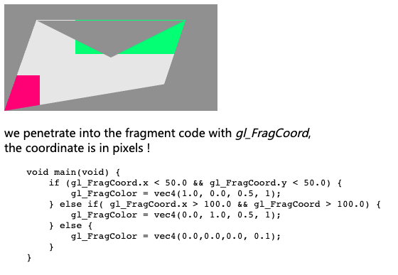
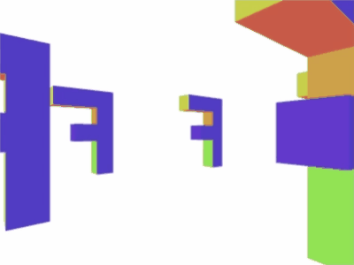

# A simple webgl tutorial

A WebGL tutorial from [**tutorialspoint**](https://www.tutorialspoint.com/webgl/index.htm).

More tutorials or documents can be found at [MDN](https://developer.mozilla.org/en-US/docs/Web/API/WebGL_API/Tutorial/Getting_started_with_WebGL).

# What I Have learned?

Unless you want to develop on WebGL, you'd better never write the `webgl code` yourself. Using third library instead!

## Markdown Contents

- [Introduction](docs/introduction.md)

- [Basic](docs/basics.md)

- [Application](docs/application.md)

- [Quick Guides](https://www.tutorialspoint.com/webgl/webgl_quick_guide.htm)

- [Draw an image in webgl](https://webglfundamentals.org/webgl/lessons/webgl-image-processing.html): `gl.createTexture();`.

- FrameBuffer:  In WebGL and OpenGL, a Framebuffer is actually a poor name. A WebGL/OpenGL Framebuffer is really just a collection of state (a list of attachments) and not actually a buffer of any kind.

- [WebGL official site](https://www.khronos.org/webgl/)

## Simple Examples

- [webgl boilerplates](https://webglfundamentals.org/webgl/lessons/webgl-boilerplate.html): A bunch of codes for writing your webgl faster.

- [test](examples/play-a-test.html)

- [point](examples/point.html): simple point example

    

- [point with color and size](examples/point-size.html): colorful point with different size

    ;

- [triangle](examples/triangle.html): using the `gl_FragCoord` to determine the color!

    

- [triangle with gradient color](examples/triangle-gradient.html)

- [circle](examples/circle.html): using `gl.TRIANGLES` and `indexBuffer` to specify the vertex.

    

- [circle fan](examples/circle-fan.html): using `gl.TRIANGLE_FAN`, without `indexBuffer`.

    

- [ring](examples/ring.html): Be careful when you drawing a triangle, the draw direction matters. [reference](https://webglfundamentals.org/webgl/lessons/webgl-3d-orthographic.html)

    

- [parallel lines](examples/parallel-lines.html)

    

- [quad](examples/quad.html)

    

- [colors](examples/colors.html): `discard` will throw away the color, which means it render with _transparency_, `gl_FragColor.a = 0.0;` means the color to be _white_, rather than _transparent_;

    

- [f-colorful-3d](examples/f-colorful-3d.html)

    

- [f-letter-3d](examples/f-letter-3d.html)

    

- [f-letter-texture](examples/f-letter-texture.html): using PNG texture to render the F letter.

- [translation](examples/translation.html)

    

- [scaling](examples/scaling.html)

    

- [rotation](examples/rotation.html)

- [perspective](examples/perspective.html): The _camera_ is moving!

    

- [cube rotation](examples/cube-rotation.html)

- [interactive cube](examples/interactive-cube.html)

## Get ActiveInfo in program

This will collect all the variable used in shader program.

```js
function checkActiveInfo(gl, program) {
  console.group('ActiveInfo in program');
  {
    const count = gl.getProgramParameter(program, gl.ACTIVE_ATTRIBUTES);
    console.log(count);
    for (let i = 0; i < count; i++) {
      let attribute = gl.getActiveAttrib(program, i);
      console.log(attribute);
    }
  }
  {
    const count = gl.getProgramParameter(program, gl.ACTIVE_UNIFORMS);
    console.log(count);
    for (let i = 0; i < count; i++) {
      let attribute = gl.getActiveUniform(program, i);
      console.log(attribute);
    }
  }
  console.groupEnd();
}
```

## Understanding Matrix

**[Matrix math for web](https://developer.mozilla.org/en-US/docs/Web/API/WebGL_API/Matrix_math_for_the_web)**: Matrix can be not only used in `webgl`, but also in `style.transform`.

The order of matrix multiplication matters, and the elements in arrays is not the same row-column order in math. [Here is an article](https://webglfundamentals.org/webgl/lessons/webgl-matrix-vs-math.html).

So, the way WebGL, and OpenGL ES on which WebGL is based, gets around this is it calls rows "columns".

```js
const some4x4TranslationMatrix = [
   1,  0,  0,  0,   // this is column 0
   0,  1,  0,  0,   // this is column 1
   0,  0,  1,  0,   // this is column 2
  tx, ty, tz,  1,   // this is column 3
];

/*
the above matrix matches the real math

  x-axis, y-axis, z-axis, w
| 1,      0,      0,      tx |
| 0,      1,      0,      ty |
| 0,      0,      1,      tz |
| 0,      0,      0,      1  |

*/

const positon = [
    1.0, 0.2, 0.3
];

/*

| 1.0 | -> x-axis
| 0.2 | -> y-axis
| 0.3 | -> z-axis

*/
```

And in the [m4.js](examples/m4.js), all the matrix are save in column-majored,

The multiplication is calculated is the real math order if you look at the [elements used](examples/m4.js#L111).

In the real math, the matrix is like

```
                                # row
        | a    b     c     d   | # r1
        | e    f     g     h   | # r2
        | i    j     k     l   | # r3
        | m    n     o     p   | # r4
#column  #c1   #c2   #c3   #c4
```

however, in `WebGL` or `openGL`, the data is saved in one array like this

```js
data = Float32Array([
    a, e, i, m, // column 1
    b, f, j, n, // column 2
    c, g, k, o, // column 3
    d, h, l, p, // column 4
]);
```

## Camera

To understand a camera, we have to introduce [perspective](https://webglfundamentals.org/webgl/lessons/webgl-3d-perspective.html) first.

Here is an picture on the difference between _orthographic_ and _perspective_.


Build a perspective matrix. It assumes there's an eye or camera at the origin `(0, 0, 0)` and given a `zNear` and a `fieldOfView`, it computes what it would take so that stuff at `zNear` ends up at `Z = -1` and stuff at `zNear` that is half of `fieldOfView` above or below the center ends up with `Y = -1` and `Y = 1` respectively. It computes what to use for X by just multiplying by the `aspect` passed in. We'd normally set this to the `width / height` of the display area. Finally, it figures out how much to scale things in `Z` so that stuff at `zFar` ends up at `Z = 1`. [Here is the demo](https://webglfundamentals.org/webgl/frustum-diagram.html).

```js
const perspective = function(fieldOfViewInRadians, aspect, near, far) {
    var f = Math.tan(Math.PI * 0.5 - 0.5 * fieldOfViewInRadians);
    var rangeInv = 1.0 / (near - far);

    return [
        f / aspect, 0, 0, 0,
        0, f, 0, 0,
        0, 0, (near + far) * rangeInv, -1,
        0, 0, near * far * rangeInv * 2, 0
    ];
},
```

[Camera article](https://webglfundamentals.org/webgl/lessons/webgl-3d-camera.html): projection matrix, camera matrix, view matrix,

```
+----+----+----+----+
| Xx | Xy | Xz |  0 |  <- x axis
+----+----+----+----+
| Yx | Yy | Yz |  0 |  <- y axis
+----+----+----+----+
| Zx | Zy | Zz |  0 |  <- z axis
+----+----+----+----+
| Tx | Ty | Tz |  1 |  <- camera position
+----+----+----+----+
```

### Examples

- [FOV: field of view](examples/field-of-view.html): The _camera_ is moving!

    

- [Camera rotating](examples/camera-rotating.html): The _camera_ is looking at `(0,0,0)` and rotating!

    

- [Camera staring and rotating](examples/camera-stare-rotating.html): The _camera_ is looking at a F Position and rotating!

    

- [Elements look at some point](examples/lookat-rotating.html): Draw some elements, make them look at one single point.

    

## Lighting

[Directional lighting documents](https://webglfundamentals.org/webgl/lessons/webgl-3d-lighting-directional.html)

Directional lighting assumes the light is coming uniformly from one direction. The sun on a clear day is often considered a directional light. It's so far way that its rays can be considered to be hitting the surface of an object all in _parallel_.

If we know what direction the light is traveling and we know what direction the surface of the object is facing we can take the dot product of the 2 directions.

[Point lighting document](https://webglfundamentals.org/webgl/lessons/webgl-3d-lighting-point.html)

[Spot lighting document](https://webglfundamentals.org/webgl/lessons/webgl-3d-lighting-spot.html)

### Examples

- [directional lighting](examples/lighting-directional.html): we can see the back of the `F` is darker than its front. The camera is rotating, the `F` and the light are still.

    

- [directional lighting ammended](examples/lighting-directional-ammended.html): the `F` is rotating, the camera and light stay still, so the face which facing the light would always be bright than those not.

    

- [directional lighting ammened and inversed](examples/lighting-directional-inversed.html): change the `worldMatrix` to adjust the normal, here is [why we have to use an inverse-transposed matrix](https://webglfundamentals.org/webgl/lessons/webgl-3d-lighting-directional.html).

    

- [Point lighting one](examples/lighting-point-one.html): A point light is created at some point, the color of the `F` is different when rotating.

    

- [Point lighting with shininess](examples/lighting-point-two.html): The point light changes its shininess.

    

- [Point lighting with color and shininess](examples/lighting-point-color.html): The point light has its own color. The color blended on the surface of `F`.

    

- [Spot lighting with fov change and focus rotating](examples/lighting-spot-one.html): Spot light is  much like point light except it has more calculation.

    

## Texture

To activate the transparency in PNG image, in fragment shader code, using

```glsl

void main() {
    gl_FragColor = vec4(1.0, 1.0, 0.0, 0.6);
    // ...
    if (gl_FragColor.a < 0.5) discard;
}
```

What is `gl.generateMipmap`?

Imagine we had this 16x16 pixel texture.


Now imagine we tried to draw that texture on a polygon 2x2 pixels big on the screen. What colors should we make those 4 pixels? There are 256 pixels to choose from. In Photoshop if you scaled a 16x16 pixel image to 2x2 it would average the 8x8 pixels in each corner to make the 4 pixels in a 2x2 image. Unfortunately reading 64 pixels and averaging them all together would be way too slow for a GPU. In fact imagine if you had a 2048x2084 pixel texture and you tried to draw it 2x2 pixels. To do what Photoshop does for each of the 4 pixels in the 2x2 result it would have to average 1024x1024 pixel or 1 million pixels times 4. That's way way too much to do and still be fast.

So what the GPU does is it uses a mipmap. A mipmap is a collection of progressively smaller images, each one 1/4th the size of the previous one. The mipmap for the 16x16 texture above would look something like this.


Generally each smaller level is just a bilinear interpolation of the previous level and that's what `gl.generateMipmap` does. It looks at the biggest level and generates all the smaller levels for you. Of course you can supply the smaller levels yourself if you want.

Now if you try to draw that 16x16 pixel texture only 2x2 pixels on the screen WebGL can select the mip that's 2x2 which has already been averaged from the previous mips.

There are 6 modes for setting the texture filtering:

- `NEAREST` = choose 1 pixel from the biggest mip
- `LINEAR` = choose 4 pixels from the biggest mip and blend them
- `NEAREST_MIPMAP_NEAREST` = choose the best mip, then pick one pixel from that mip
- `LINEAR_MIPMAP_NEAREST` = choose the best mip, then blend 4 pixels from that mip
- `NEAREST_MIPMAP_LINEAR` = choose the best 2 mips, choose 1 pixel from each, blend them
- `LINEAR_MIPMAP_LINEAR` = choose the best 2 mips. choose 4 pixels from each, blend them

The simple way to think of texture units is something like this: All of the texture functions work on the "active texture unit". The "active texture unit" is just a global variable that's the index of the texture unit you want to work with. Each texture unit has 2 targets. The TEXTURE_2D target and the TEXTURE_CUBE_MAP target. Every texture function works with the specified target on the current active texture unit. If you were to implement WebGL in JavaScript it would look something like this:

```js
var getContext = function() {
  var textureUnits = [
    { TEXTURE_2D: ??, TEXTURE_CUBE_MAP: ?? },
    { TEXTURE_2D: ??, TEXTURE_CUBE_MAP: ?? },
    { TEXTURE_2D: ??, TEXTURE_CUBE_MAP: ?? },
    { TEXTURE_2D: ??, TEXTURE_CUBE_MAP: ?? },
    { TEXTURE_2D: ??, TEXTURE_CUBE_MAP: ?? },
    ...
  ];
  var activeTextureUnit = 0;

  var activeTexture = function(unit) {
    // convert the unit enum to an index.
    var index = unit - gl.TEXTURE0;
    // Set the active texture unit
    activeTextureUnit = index;
  };

  var bindTexture = function(target, texture) {
    // Set the texture for the target of the active texture unit.
    textureUnits[activeTextureUnit][target] = texture;
  };

  var texImage2D = function(target, ... args ...) {
    // Call texImage2D on the current texture on the active texture unit
    var texture = textureUnits[activeTextureUnit][target];
    texture.image2D(...args...);
  };

  // return the WebGL API
  return {
    activeTexture: activeTexture,
    bindTexture: bindTexture,
    texImage2D: texImage2D,
  }
};
```

### Examples

- [cube with image texture](examples/texture-cube.html): Derived from this [MDN detailed document](https://developer.mozilla.org/en-US/docs/Web/API/WebGL_API/Tutorial/Using_textures_in_WebGL)

    

- [Square with image, transparency](examples/texture-square.html).

    

- basic image texture example: [one](examples/texture-image-base.html); [two](examples/texture-image-base2.html)

    

    

- [mipmap in texture](examples/mipmap-one.html): some detailed illustration is [here](#texture).

    

- [texture from canvas](examples/mipmap-lane.html): Using canvas as a texture [source](examples/mipmap-lane.html#L96)

    

- [texture atlas!](examples/texture-noodles.html): applying multiple images using 1 texture

    

    

- [texture alignment issue](examples/texture-data-alignment.html): when WebGL reading  data from buffer, it can read 1/2/4/8 bytes once a time , [here is why](https://webglfundamentals.org/webgl/lessons/webgl-data-textures.html)

    

- [texture benefits from framebuffer](examples/texture-rendering-one.html): using framebuffer to render a texture, and then render that texture to the canvas.

    

- [textures with two images, and with two color mixture mode](examples/texture-more-pictures.html): Using two pictures to draw, with different color mixture mode.

    

- [switch between textures](examples/texture-exchange-pictures.html)

    

- [color with gradient](examples/texture-gradient.html): The webgl draw the color on the pixels and using interpolation to draw the rest color.

    

- [cube texture mapping](examples/texture-cubemaps.html): We create 6 texture from canvas, and apply them to the `TEXTURE_CUBE_MAP`.

    

    Here is a [document](https://webglfundamentals.org/webgl/lessons/webgl-environment-maps.html) for reflecting the room. [The file](examples/texture-environment-maps.html).

    

## Framebuffer

[docs](https://webglfundamentals.org/webgl/lessons/webgl-render-to-texture.html)

A framebuffer is just a collection of attachments. Attachments are either textures or renderbuffers. Renderbuffers are very similar to textures but they support formats and options that textures don't support. Also, unlike a texture you can't directly use a renderbuffer as input to a shader.

>
>## The Canvas itself is actually a texture
>
>This is just trivia but browsers use the techniques above to implement the canvas itself. Behind the scenes they create a color texture, a depth buffer, a framebuffer and then they bind it as the current framebuffer. You do your rendering which draws into that texture. They then use that texture to render your canvas into the web page.
>

## Conditional Statement in GLSL

There is a GLSL function called `step`. It takes 2 values and if the second value is greater than or equal the first, it returns `1.0`. Otherwise it returns `0.0`. Similar in JavaScript:

```js
function step(a, b) {
    if (b >= a) {
        return 1.0;
    } else {
        return 0.0;
    }
}
```

GLSL also has a function called `smoothstep` and like `step` it returns a value from `0.0` to `1.0` but it takes both an lower and upper bound and lerps between `0.0` and `1.0` between those bounds.


The difference is `smoothstep` uses a Hermite interpolation instead of a linear interpolation. That means between `lowerBound` and `upperBound` it intepolates like the image below on the right whereas a linear interpolation is like the image on the left.

One other thing to be aware is the `smoothstep` function has undefined results if the `lowerBound` is greater than or equal to `upperBound`. Having them be equal is the same issue we had above. The added issue of not being defined if `lowerBound` is greater than `upperBound` is new but for the purpose of a spotlight that should never be true.
