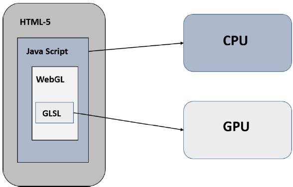
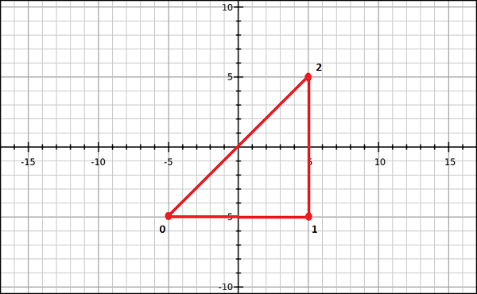
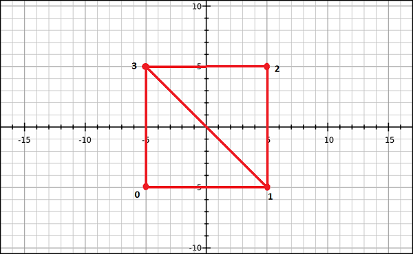

# Sample Application

We are going to take a sample application to create a triangle using WebGL and observe the steps followed in the application.

## Structure of WebGL Application

WebGL application code is a combination of JavaScript and OpenGL Shader Language.

- JavaScript is required to communicate with the CPU

- OpenGL Shader Language is required to communicate with GPU



```html
<!doctype html>
<html>
<head>
<meta charset="UTF-8">
     <meta name="viewport" content="width=device-width, user-scalable=no, initial-scale=1.0, maximum-scale=1.0, minimum-scale=1.0">
     <meta http-equiv="X-UA-Compatible" content="ie=edge">
     <title>Document</title>
</head>
<body>
<canvas width="300" height="300" id="mc"></canvas>
<script >
    /* Step1: prepare the canvas and get WebGL context */
    var canvas = document.querySelector('#mc');
    var gl = canvas.getContext('webgl');

    /* Step2: Define the geometry and store it in buffer objects */
    var vertices = [-0.5, 0.5, -0.5, -0.5, 0.0, -0.5];

    // create a new buffer object
    var vertex_buffer = gl.createBuffer();

    // bind an empty array buffer to it
    gl.bindBuffer(gl.ARRAY_BUFFER, vertex_buffer);

    // pass the vertices data to the buffer
    gl.bufferData(gl.ARRAY_BUFFER, new Float32Array(vertices), gl.STATIC_DRAW);

    // unbind the buffer
    gl.bindBuffer(gl.ARRAY_BUFFER, null);

    /* Step3: Create and compile Shader program */

    // vertex shader source code
    var vertCode = 'attribute vec2 coordinates;' + 'void main(void) { gl_Position = vec4(coordinates, 0.0, 1.0); }';

    // create a vertex shader object
    var vertShader = gl.createShader(gl.VERTEX_SHADER);

    // attach vertex shader source code
    gl.shaderSource(vertShader, vertCode);

    // compile the vertex shader
    gl.compileShader(vertShader);

    // fragment shader source code
    var fragCode = 'void main(void) { gl_FragColor = vec4(0.0, 0.0, 0.0, 0.1);}';

    // create fragment shader object
    var fragShader = gl.createShader(gl.FRAGMENT_SHADER);

    // attach fragment shader source code
    gl.shaderSource(fragShader, fragCode);

    // compile the fragment shader
    gl.compileShader(fragShader);

    // create a shader program object to store combined shader program
    var shaderProgram = gl.createProgram();

    // attach vertex shader
    gl.attachShader(shaderProgram, vertShader);

    // attach fragment shader
    gl.attachShader(shaderProgram, fragShader);

    // link both programs
    gl.linkProgram(shaderProgram);

    // use the combined shader program object
    gl.useProgram(shaderProgram);

    /* Step4: Associate the sahder program to buffer objects */

    // bind vertex buffer object
    gl.bindBuffer(gl.ARRAY_BUFFER, vertex_buffer);

    // get the attribute location
    var coord = gl.getAttribLocation(shaderProgram, "coordinates");

    // Tell the attribute how to get data out of positionBuffer (ARRAY_BUFFER)
    var size = 2;          // 2 components per iteration
    var type = gl.FLOAT;   // the data is 32bit floats
    var normalize = false; // don't normalize the data
    var stride = 0;        // 0 = move forward size * sizeof(type) each iteration to get the next position
    var offset = 0;        // start at the beginning of the buffer
    gl.vertexAttribPointer(coord, size, type, normalize, stride, offset);

    // enable the attribute
    gl.enableVertexAttribArray(coord);

    /* Step5: Drawing the required object (triangle) */

    // clear the canvas
    gl.clearColor(0.5, 0.5, 0.5, 0.9);

    // enable the depth test
    gl.enable(gl.DEPTH_TEST);

    // clear the color buffer bit
    gl.clear(gl.COLOR_BUFFER_BIT);

    // set the view port
    gl.viewport(0, 0, canvas.clientWidth, canvas.clientHeight);

    // draw the triangles
    var primitiveType = gl.TRIANGLES;
    var offset = 0;
    var count = 3;
    gl.drawArrays(primitiveType, offset, count);

</script>

</body>
</html>
```

If you observe the above program carefully, we have followed five sequential steps to draw a simple triangle using WebGL. The steps are as follows:

1. **Prepare the canvas and get WebGL rendering context**

    We get the current HTML canvas object and obtain its WebGL rendering context.

1. **Define the geometry and store it in buffer objects**

    We define the attributes of the geometry such as vertices, indices, color, etc., and store them in the JavaScript arrays. Then we create one or more buffer objects and pass the arrays containing the data to the respective buffer object.

1. **Create nad compile shader programs**

    We write vertex shader and fragment shader programs, compile them, and create a combined program by linking these two programs.

1. **Associate the shader programs with buffer objects**

    We associate the buffer objects and the combined shader program.

1. **Drawing the required object**

    This step includes operations such as clearing the color, clearing the buffer bit, enabling the depth test, setting the view port, etc. Finally you need to draw the required primitives using one of the methods - `drawArrays()` or `drawElements`.

# Context

To write a WebGL application, first step is to get the WebGL rendering context object. This object interacts with the WebGL drawing buffer and can call all the WebGL methods. The following operations are performed to obtain the WebGL context −

1. Create an HTML-5 canvas

1. Get the canvas ID

1. Obtain WebGL

## Creating HTML-5 Canvas Element and Get the Canvas

Within the body of the HTML-5 document, write a canvas, give it an id. Also, we define the dimensions of the canvas using the width and height.

```html
<html>
<head>
<meta charset="UTF-8">
     <meta name="viewport" content="width=device-width, user-scalable=no, initial-scale=1.0, maximum-scale=1.0, minimum-scale=1.0">
     <meta http-equiv="X-UA-Compatible" content="ie=edge">
     <title>Document</title>
</head>
<body>
<canvas id="mc"></canvas>

<script>
    var canvas = document.querySelector('#mc');
</script>
</body>
</html>
```

## Getting the WebGL Drawing Context

To get the WebGLRenderingContext object, call the `getContext()` method of the current **HTMLCanvasElement**.

```javascript
canvas.getContext(contextType, contextAttributes);
```

Pass the string `"webgl"` or `"experimental-webgl"` as the `contentType`. The `contextAttributes` parameter is optional.

>The parameter `WebGLContextAttributes` is not mandatory. This parameter provides various options that accept Boolean values as listed below:
>
> |Attribute|Description|
> |:-:|-|
> |alpha|If its value is true, it provides an alpha buffer to the canvas. By default, its value is true.|
> |depth|If its value is true, you will get a drawing buffer which contains a depth buffer of at least 16 bits. By default, its value is true.|
> |stencil|If its value is true, you will get a drawing buffer which contains a stencil buffer of at least 8 bits. By default, its value is false.|
> |antialias|If its value is true, you will get a drawing buffer which performs anti-aliasing. By default, its value is true.|
> |premultipliedAlpha|If its value is true, you will get a drawing buffer which contains colors with pre-multiplied alpha. By default, its value is true.|
> |preserveDrawingBuffer|If its value is true, the buffers will not be cleared and will preserve their values until cleared or overwritten by the author. By default, its value is false.|
>
> At the time of creating the WebGLRendering Context, a drawing buffer is created. The Context object manages OpenGL state and renders to the drawing buffer.
>
> WebGLRenderingContext
>
> It is the principal interface in WebGL. It represents the WebGL drawing context. This interface contains all the methods used to perform various tasks on the drawing buffer. The attributes of this interface are given in the following table.
>
> |Attributes|Description|
> |:-:|-|
> |Canvas|This is a reference to the canvas element that created this context.|
> |drawingBufferWidth|This attributes represents the actual width of the drawing buffer. It may differ from the width attribute of the HTMLCanvasElement.|
> |drawingBufferHeight|This attributes represents the actual width of the drawing buffer. It may differ from the width attribute of the HTMLCanvasElement.|

# Geometry

After obtaining the WebGL context, you have to define the geometry for the primitive (object you want to draw) and store it. In WebGL, we define the details of a geometry - for example, vertices, indices, color of the primitive - using JavaScript arrays. To pass these details to the shader programs, we have to create the buffer objects and store (attach) the JavaScript arrays containing the data in the respective buffers.

> Later, these buffer objects will be associated with the attributes of the shader program (vertex shader).

## Defining the required Geometry

A 2D or 3D model drawn using vertices is called **mesh**. Each facet in a mesh is called a **polygon** and a polygon is made of 3 or more vertices.

To draw models in the WebGL rendering context, you have to define the vertices and indices using Javascript arrays.

For example, if we want to create a triangle which lies on the coordinates `{ (5,5), (-5,5), (-5,-5) }` as shown in the diagram, then you need to create an array for the vertices as:

```javascript
const vertices = [
    0.5, 0.5, // vertex 1
    0.5, -0.5, // vertex 2
    -0.5, -0.5 // vertex 3
];
```



Similarly, you can create an array for the indices. Indices for the above triangle indices will be [0, 1, 2] and can be defined as:

```javascript
const indices = [0, 1, 2];
```

For a better understanding of indices, consider more complex models like square. We can represent a square as a set of two triangles. If `(0,3,1)` and `(3,1,2)` are the two triangles using which we intend to draw a square, then the indices will be defined as:

```javascript
const indices = [0, 3, 1, 3, 1, 2];
```



For drawing primitives, WebGL provides the following two methods:

- `drawArray()`: while using this method, we pass the vertices of the primitive using JavaScript arrays.

- `drawElement()`: while using this method, we pass both vertices and indices of the primitive using JavaScript arrays.

## Buffer Object

A buffer object is a mechanism provided by WebGL that indicates a memory area allocated in the system. In these buffer objects, you can store data of the model you want to draw, corresponding to vertices, indices, color, etc.

Using these buffer objects, you can pass multiple data to the shader program (vertex shader) through one of its attribute variables. Since these buffer objects reside in the GPU memory, they can be rendered directly, which in turn improves the performance.

To process geometry, there are two types of buffer objects:

- **Vertex buffer object (VBO)**: It holds the per-vertex data of the graphical model that is going to be rendered. We use vertex buffer objects in WebGL to store and process the data regarding vertices such as vertex coordinates, normals, colors, and texture coordinates.

- **Index buffer object (IBO)**: It holds the indices (index data) of the graphical model that is going to be rendered.

After defining the required geometry and storing them in JavaScript arrays, you need to pass these arrays to the buffer objects, from where the data will be passed to the shader programs. The following steps are to be followed to store data in the buffers.

1. Create an empty buffer.

1. Bind an appropriate array object to the empty buffer.

1. Pass the data (vertices/indices) to the buffer using one of the **type arrays**.

1. Unbind the buffer (optional).

## Creating a Buffer

To create an empty buffer object, WebGL provides a method called `createBuffer()`. This method returns a newly created buffer object, if the creation is successful; else it returns a `null` in case of failure.

WebGL operates as a state machine. Once a buffer is created, any subsequent buffer operation will be executed on the current buffer until we unbound it. Usi the following code to create a buffer -

```javascript
const vertex_buffer = gl.createBuffer();
```

## Binding the buffer

After creating an empty buffer object, you need to bind an appropriate array buffer to it. WebGL provides a method called `bindBuffer()` for this purpose.

```
void bindBuffer(enum target, Object buffer)
```

This method accepts two parameters:

**target**: The first variable is an enum value representing the type of the buffer we want to bind to the empty buffer. There are two predefined enum values as options for this parameter. They are:

1. `ARRAY_BUFFER` which represents vertex data.

1. `ELEMENT_ARRAY_BUFFER` which represents index data.

**object buffer**: The second one is the reference variable to the buffer object created in the previous step. The reference variable can be of a vertex buffer object or of an index buffer object.

## Passing Data into the Buffer

The next step is to pass the data (vertices/indices) to the buffer. Till now data is in the form of an array and before passing it to the buffer, we need to wrap it in one of the WebGL typed arrays. WebGL provides a method name `bufferData()` for this purpose.

```
void bufferData(enum target, Object data, enum usage)
```

This method accepts three parameters:

**target**: The first parameter is an enum value representing the type of the array buffer. The options for this parameter are:

1. `ARRAY_BUFFER` which represents **vertex data**.

1. `ELEMENT_ARRAY_BUFFER` which represents **index data**.

**Object data**: The second parameter is the object value that contains the data to be written to the buffer object. We have to pass the data using **typed arrays**.

**Usage**: The third parameter of this method is an enum variable that specific how to use the buffer object data (stored data) to draw shapes. The options are:

1. `gl.STATIC_DRAW` - Data will be specified once and used many times.

1. `gl.STREAM_DRAM` - Data will be specified once and used a few times.

1. `gl.DYNAMIC_DRAW` - Data will be specified repeatedly and used many times.

## Typed Arrays

WebGL provides a special type of array called **typed arrays** to transfer the data elements such as index vertex and texture. These typed arrays store large quantities of data and process them in native binary format which results in better performance. The typed arrays used by WebGL are `Int8Array`, `Uint8Array`, `Uint16Array`, `Int32Array`, `Uint32Array`, `Float32Array`, `Float64Array`.

> Generally, for storing vertex data, we use `Float32Arary`, and to store index data, we use `Uint16Array`.
>
> Use the `new` keyword to create typed arrays.

## Unbinding the buffer

It is recommended that you unbind the buffers after using them. It can be done by passing `null` value in place of the buffer object, as shown:

```javascript
gl.bindBuffer(gl.ELEMENT_ARRAY_BUFFER, null);
```

# Shaders

Shaders are the programs that run on GPU. Shaders are written in OpenGL ES Shader Language (aka, ES SL). ES SL has variables of its own, data types, qualifiers, built-in inputs and outputs.

## Data type

|           Type            | Description                          |
|:-------------------------:|:-------------------------------------|
|          `void`           | Represents an empty value            |
|          `bool`           | Accepts `true` or `false`            |
|           `int`           | A signed integer data type           |
|          `float`          | A floating scalar data type          |
|  `vec2`, `vec3`, `vec4`   | An n-component floating point vector |
| `bvec2`, `bvec3`, `bvec4` | Boolean vector                       |
| `ivec2`, `ivec3`, `ivec4` | Signed integer vector                |
|  `mat2`, `mat3`, `mat4`   | 2x2, 3x3, 4x4 float matrix           |
|        `sampler2D`        | Access a 2D texture                  |
|       `samplerCube`       | Access cube mapped texture           |

`vec4` has many meanings in different shaders, but

- `v.x` is the same as `v.s` and `v.r` and `v[0]`.
- `v.y` is the same as `v.t` and `v.g` and `v[1]`.
- `v.z` is the same as `v.p` and `v.b` and `v[2]`.
- `v.w` is the same as `v.q` and `v.a` and `v[3]`.

It is able to swizzle vec components which means you can repeat or swap components.

- `vec4(v.yyyy)` means `vec4(v.y, v.y, v.y, v.y)`

- `vec4(v.bgra)` means `vec4(v.b, v.g, v.r, v.a)`

- `vec4(v.rgb, y)` means `vec4(v.r, v.g, v.b, 1)`

## Qualifiers

There are three main qualifiers in OpenGL ES SL:

|  Qualifier  |                                                                                                    Description                                                                                                    |
|:-----------:|:-----------------------------------------------------------------------------------------------------------------------------------------------------------------------------------------------------------------:|
| `attribute` |                      This qualifier acts as a link between a vertex shader and OpenGL ES for per-vertex data. The value of this attribute changes for every execution of the vertex shader.                       |
|  `uniform`  | This qualifier links shader programs and the WebGL application. Unlike attribute, the values of uniforms do not change. Uniforms are read-only; you can use them with any basic data types to declare a variable. |
|  `varying`  |        This qualifier forms a link between a vertex shader and fragment shader for interpolated data. It can be used with the following data types - float, vec2, vec3, vec4, mat2, mat3, mat4, or arrays.        |

## Vertex Shader

Vertex shader is a program code, which is called on every vertex. It transforms (move) the geometry from one place to other. It handles the data of each vertex (per-vertex data) such as vertex coordinates, normals, colors, and texture coordinates.

In the ES GL code of vertex shader, programmers have to define attributes to handle data. These attributes point to a Vertex Buffer Object written in JavaScript. The following tasks can be performed using vertex shaders along with vertex transformation:

- Vertex transformation
- Normal transformation and normalization
- Texture coordinate generation
- Texture coordinate transformation
- Lighting
- Color material application

### Predefined Variables

OpenGL ES SL provides the following predefined variables for vertex shader:

|         Variables          |                               Description                               |
|:--------------------------:|:-----------------------------------------------------------------------:|
|   highp vec4 gl_Position   |                    Holds the position of the vertex                     |
| mediump float gl_PointSize | Holds the transformed point size. The units for the variable are pixels |

Take a look at the following sample code of a vertex shader. It processes the vertices of a triangle.

```
attribute vec2 coordinates;

void main(void) {
    gl_Position = vec4(coordinates, 0.0, 1.0);
}
```

If you observe the code carefully, we have declared an attribute variable with the name `coordinates` which will be associated with the Vertex Buffer Object using the method `getAttribLocation()`. The attribute `coordinates` is passed as a parameter to this method along with the shader program object.

In the second step of the given vertex shader program, the `gl_Position` variable is defined.

`gl_Position` is the predefined variable which is available only in the vertex shader program. It contains the vertex position. In the above code, the `coordinates` attribute is passed in the form of a vector. As vertex shader is a per-vertex operation, the `gl_Position` value is calculated for each vertex.

Later, the `gl_Position` value is used by primitive assembly, clipping, culling, and other fixed functionality operations that operate on the primitives after the vertex processing is over.

## Fragment Shader

A **mesh** is formed by multiple triangles, and the surface of each triangle is known as **fragment**. A fragment shader is the code that runs on every pixel on each fragment. This is written to calculate and fill the color on individual pixels. The following tasks can be performed using fragment shaders -

- Operations on interpolated values
- Texture access
- Texture application
- Fog
- Color sum

### Predefined Variables

OpenGL ES SL provides the following predefined variables for fragment shader:

|          Variables          |                              Description                              |
|:---------------------------:|:---------------------------------------------------------------------:|
|  mediump vec4 gl_FragCoord  |          Holds the fragment position within the frame buffer          |
|     bool gl_FrontFacing     |      Holds the fragment that belongs to a front-facing primitive      |
| mediump vec2 gl_PointCoord  | Holds the fragment position within a point (point rasterization only) |
|  mediump vec4 gl_FragColor  |          Holds the output fragment color value of the shader          |
| mediump vec4 gl_FragData[n] |            Holds the fragment color for color attachment n            |

```
void main(void) {
    gl_FragColor = vec4(0, 0.8, 0, 1);
}
```

In the above code, the **color** value is stored in the variable `gl_FragColor`. The fragment shader program passes the output to the pipeline using fixed function variables

## Storing and Compiling the Shader Programmes

Since shaders are independent programmes, we can write them as a separate script and use in the application. Or, you can store them directly in **string** format, as shown below:

```javascript
var vertCode=`
attribute vec2 coordinates;
void main(void) {
    gl_Position = vec4(coordinates, 0.0, 1.0);
}
`;
```

Compilation involves following three steps:

1. Creating the shader object

1. Attaching the source code to the created shader object

1. Compiling the programme

To create an empty shader, WebGL provides a method called `createShader()` which creates and returns the shader object:

```
Object createShader(enum type)
```

As observed in the syntax, this method accepts a predefined enum value as parameter. We have two options for this -

- `gl.VERTEX_SHADER` for creating vertex shader

- `gl.FRAGMENT_SHADER` for creating fragment shader

And, we can attach the source code to the created shader object using the method `shaderSource()`:

```
void shaderSource(Object shader, string source)
```

This method accepts two parameters:

- `shader` the created shader object as the first parameter.

- `source` the shader program code in string format.

Now we can compile the program by using the method `compileShader()`:

```
compileShader(Object shader)
```

This method accepts the shader program object as a parameter. After creating a shader program object, attach the source code to it and pass that object to this method.

Let's look at an example:

```javascript
const vertCode =`
attribute vec3 coordinates;
void main(void) {
    gl_Position = vec4(coordinates, 1.0);
}
`;
const vertShader = gl.createShader(gl.VERTEX_SHADER);
gl.shaderSource(vertShader, vertCode);
gl.compileShader(vertShader);

const fragCode = `
void main(void) {
    gl_FragColor = vec4(0, 0.8, 0, 1);
}
`;
const fragShader = gl.createShader(gl.FRAGMENT_SHADER);
gl.shaderSource(fragShader, fragCode);
gl.compileShader(fragShader);
```

## Combined Programme

After creating and compiling both shader programmes, we need to create a combined program containing both the shader (vertex & fragment). The following steps need to be followed:

1. Create a program object

1. Attach both the shaders

1. Link both the shaders

1. Use the program

By using the method `createProgram()` we obtain an empty program object:

```
createProgram();
```

And then we attach the shaders to the created program object using the method `attachShader()` which accepts two parameters:

- `program` pass the created empty program object as first parameter

- `shader` pass one of the compiled shader program, you need to attach both the vertex shader and fragment shader by call this method twice.

```
attachShader(Object program, Object shader);
```

Then using `linkProgram()` to link the shaders by passing the object to which you have attached the shaders,

```
linkProgram(shaderProgram);
```

Now, we are good to use the program by calling `useProgram()`.

Take a look at the full snippet:

```javascript
const shaderProgram = gl.createProgram();
gl.attachShader(shaderProgram, vertShader);
gl.attachShader(shaderProgram, fragShader);
gl.linkProgram(shaderProgram);
gl.useProgram(shaderProgram);
```

# Associating Attributes & Buffer Objects

Each attribute in the vertex shader program points to a vertex buffer object. After creating the vertex buffer objects, programmers have to associate them with the attributes of the vertex shader program. Each attribute points to only one vertex buffer object from which they extract the data values, and then these attributes are passed to the shader program.

To associate the vertex buffer objects with the attributes of the vertex shader program, we have to follow the steps:

1. Get the attribute location

1. Point the attribute to a vertex buffer object

1. Enable the attribute

## Get the Attribute Location

WebGL provides a method called `getAttribLocation()` which returns the attribute location. Its syntax is as follows:

```
ulong getAttribLocation(Object program, string name)
```

This method accepts the vertex shader program object and the attribute values of the vertex shader program. For example,

```javascript
const coordinatesVar = gl.getAttribLocation(shaderProgram, 'coordinates');
```

## Point the Attribute to a VBO

To assign the buffer object to the attribute variable, WebGL provides a method called `vertexAttribPointer()`:

```
void vertexAttribPointer(location, int size, enum type, bool normalized, long stride, long offest)
```

This method accepts six parameters and they are discussed below.

- `location`: it specifies the storage location of an attribute variable. Under this option, you have to pass the value returned by the `getAttribLocation()` method.

- `size`: it specifies the number of components per vertex in the buffer object.

- `type`: it specifies the type of data.

- `normalized`: this is a boolean value. If `true`, non-floating data is normalized to `[0,1]`; else, it is normalized to `[-1,1]`;

- `stride`: it specifies the number of bytes between different vertex data elements, or zero for default stride.

- `offset`: it specifies the offset (in bytes) in a buffer object to indicate which byte the vertex data is stored from. If the data is stored from the beginning, `offset` is `0`.

For example:

```javascript
gl.vertexAttribPointer(coordinatesVar,3, gl.FLOAT, false,0,0);
```

## Enabling the Attribute

Active the vertex shader attribute to access the buffer object in a vertex shader. For this operation, WebGL provides `enableVertexAttribArray()` method. This method accepts the location of the attribute as a parameter.

```javascript
gl.enableVertexAttribArray(coordinatesVar);
```

# Drawing a Model

After associating teh buffers with the shaders, the final step is to draw the required primitives. WebGL provides two method namely, `drawArrays()` and `drawElements()` to draw models.

## drawArrays()

`drawArrays()` is the method which is used to draw models using vertices:

```
void drawArrays(enum mode, int first, long count)
```

This method takes the following three parameters:

- `mode`: in WebGL, models are drawn using primitive types. Using model, programmers have to choose one of the primitive types provided by WebGL. The possible values for this option are `gl.POINTS`, `gl.LINE_STRIP`, `gl.LINE_LOOP`, `gl.LINES`, `gl.TRIANGLE_STRIP`, `gl.TRIANGLE_FAN`, `gl.TRIANGLES`.

- `first`: This option specifies the starting element in the enabled arrays. It cannot be a negative value.

- `count`: This option specifies the number of elements to be rendered.

If you draw a model using `drawArrays()` method, then WebGL, while rendering the shapes, creates the geometry in the order in which the vertex coordinates are defined.

For example, if you want to draw a single triangle using `drawArray()` method, then you have to pass three vertices and call the `drawArrays()` method:

```javascript
const vertices = [-0.5,-0.5, -0.25, 0.5, 0.0, -0.5];
gl.drawArrays(gl.TRIANGLES, 0, 3);
```


And suppose you want to draw contiguous triangles, then you have to pass the next three vertices in order in the vertex buffer and mention the number of elements to be rendered as 6.

```javascript
const vertices = [-0.5,-0.5, -0.25,0.5, 0.0,-0.5, 0.0,-0.5, 0.25,0.5, 0.5,-0.5,];
gl.drawArrays(gl.TRIANGLES, 0, 6);
```


## drawElements

`drawElements()` is the method that is used to draw models using vertices and indices:

```
void drawElements(enum mode, long count, enum type, long offset)
```

This method takes the following four parameters:

- `mode` - WebGL models are drawn using primitive types. Using mode，programmers have to choose one of the primitive types provided by WebGL. The list of possible values for this option are - `gl.POINTS`, `gl.LINE_STRIP`, `gl.LINE_LOOP`, `gl.TRIGANLE_STRIP`, `gl.TRIAGNLE_FAN`, `gl.TRIANGLES`.

- `count` - This option specifies the number of the elements to be rendered.

- `type` - This option specifies the data type of the indices which must be `UNSIGNED_BYTE` or `UNSIGNED_SHORT`.

- `offset` - This option specifies the starting point for rendering. It is usually the first element (0);

If you draw a model using `drawElements()` method, then index buffer object should also be created along with the vertex buffer object. If you use this method, the vertex data will be processed once and used as many times as mentioned in the indices.

For example:

If you want to draw a single triangle using indices, you need to pass the indices along with vertices and call the `drawElements()` method as shown below.

```javascript
const vertices = [-0.5, -0.5, 0.0, -0.25, 0.5, 0.0, 0.0, -0.5, 0.0];
const indices = [0, 1, 2];
gl.drawElements(gl.TRIANGLES, indices.length, gl.UNSIGNED_SHORT, 0);
```

It will produce the following output -


If you want to draw contagious triangles using `drawElements()` method, simply add the other vertices and mention the indices for the remaining vertices.

```javascript
const vertices = [
    -0.5,-0.5,0.0,
    -0.25,0.5,0.0,
    0.0,-0.5,0.0,
    0.25,0.5,0.0,
    0.5,-0.5,0.0
];
const indices = [0, 1, 2, 2, 3, 4];
gl.drawElements(gl.TRIANGLES, indices.length, gl.UNSIGNED_SHORT, 0);
```

And it will produce the following output -


## Required Operations

Before drawing a primitive, you need to perform a few operations, which are explained below.

1. Clear the Canvas

    First of all, you should clear the canvas, using `clearColor()` method. You can pass the RGBA values of a desired color as parameter to this method. Then WebGL clears the canvas and fills it with the specified color. Therefore, you can use this method for setting the background color.

1. Enable Depth Test

    Enable the depth test using the `enable()` method like this:

    ```javascript
    gl.enable(gl.DEPTH_TEST);
    ```

1. Clear the Color BufferBit

    Clear the color as well as the depth buffer by using the `clear()` method:

    ```javascript
    gl.clear(gl.COLOR_BUFFER_BIT | gl.DEPTH_BUFFER_BIT);
    ```

1. Set the View Port

    The view port represents a rectangular viewable area that contains the rendering results of the drawing buffer. You can set the dimensions of the view port using `viewport()` method. In the following code, the view port dimensions are set to the canvas dimensions.

    ```javascript
    gl.viewport(0, 0, canvas.width, canvas.height);
    ```
