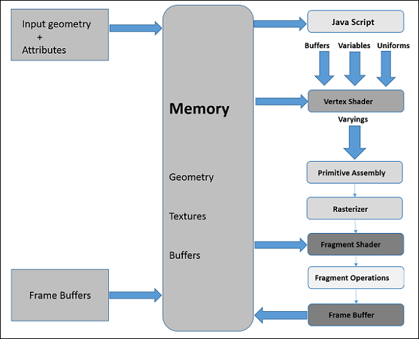

# Basics

WebGL is mostly a low-level rasterization API rather than a 3D API. To draw an image using WebGL, you have to pass a vector representing the image. It then converts the given vector into pixel format using OpenGL SL and displays the image on the screen. Writing a WebGL application involves a set of steps which we would be explaining in this chapter.

## Coordinate System

Just like any other 3D system, you will have *x*, *y* and *z* axes in WebGL, where the *z* axis signifies *depth*. The coordinates in WebGL are restricted to (1, 1, 1) and (-1, -1, - 1). WebGL won’t display anything that is drawn beyond these boundaries.

The above diagram depicts the WebGL coordinate system. The *z-axis* signifies depth. A positive value of *z* indicates that the object is near the screen/viewer, whereas a negative value of *z* indicates that the object is away from the screen. Likewise, a positive value of *x* indicates that the object is to the right side of the screen and a negative value indicates the object is to the left side. Similarly, positive and negative values of *y* indicate whether the object is at the top or at the bottom portion of the screen.

## Graphics

After getting the WebGL context of the canvas object, you can start drawing graphical elements using WebGL API in JavaScript.

### Vertices

Generally, to draw objects such as a polygon, we mark the points on the plane and join them to form a desired polygon. A **vertex** is a point which defines the conjunction of the edges of a 3D object. It is represented by three floating point values each representing *x*, *y*, *z* axes respectively.

> **Note**: we have to store these vertices manually using JavaScript arrays and pass them to the WebGL rendering pipeline using vertex buffer.

### Indices

In WebGL, numerical values are used to identify the vertices. These numerical values are knowns as indices. These indices are used to draw meshes in WebGL.

> **Note**: Just like vertices, we store the indices using JavaScript arrays and pass them to WebGL rendering pipeline using index buffer.

### Arrays

Unlike OpenGl and JoGL, there are no predefined methods in WebGL to render the vertices directly. We have to store them manually using JavaScript arrays.

### Buffers

Buffers are the memory areas of WebGL that hold the data. There are various buffers namely, drawing buffer, frame buffer, vertex buffer, and index buffer. The **vertex buffer** and **index buffer** are used to describe and process the geometry of the model.

**Vertex buffer** objects store data about the vertices, while **Index buffer** objects store data about the indices. After storing the vertices into arrays, we pass them to WebGL graphics pipeline using these Buffer objects.

**Frame buffer** is a portion of graphics memory that hold the scene data. This buffer contains details such as width and height of the surface (in pixels), color of each pixel, depth and stencil buffers.

## Mesh

To draw 2D or 3D objects, the WebGL API provides two methods namely, **drawArrays()** and **drawElements()**. These two methods accept a parameter called mode using which you can select the object you want to draw. The options provided by this field are restricted to points, lines, and triangles.

To draw a 3D object using these two methods, we have to construct one or more primitive polygons using points, lines, or triangles. Thereafter, using those primitive polygons, we can form a mesh.

A 3D object drawn using primitive polygons is called a **mesh**. WebGL offers several ways to draw 3D graphical objects, however users normally prefer to draw a mesh.

In the above example, you can observe that we have drawn a square using two triangles -> { 1, 2, 3 } and { 4, 1, 3 }.

## Shader Programmes

We normally use triangles to construct meshes. Since WebGL uses GPU accelerated computing, the information about these triangles should be transferred from CPU to GPU which takes a lot of communication overhead.

WebGL provides a solution to reduce the communication overhead. Since it uses ES SL (Embedded System Shader Language) that runs on GPU, we write all the required programs to draw graphical elements on the client system using **shader programs**.

These shaders are the programs for GPU and the language used to write shader program is GLSL. In these shaders, we define exactly how vertices, transformations, materials, lights, and camera interact with one another to create a particular image.

In short, it is a snippet that implements algorithms to get pixels for a mesh.

### Vertex Shader

Vertex shader is the program code called on every vertex. It is used to transform (move) the geometry from one place to another. It handles the data of each vertex such as vertex coordinates, normals, colors, and texture coordinates.

In the **ES GL** code of vertex shader, programmers have to define attributes to handle the data. These attributes point to a **Vertex Buffer Object** written in JavaScript.

The following tasks can be performed using vertex shaders:

- Vertex transformation

- Normal transformation and normalization

- Texture coordinate generation

- Texture coordinate transformation

- Lighting

- Color material application

### Fragment Shader (Pixel Shader)

A mesh is formed by multiple triangles, and the surface of each of the triangles is known as a **fragment**. Fragment shader is the code that runs on all pixels of every fragment. It is written to calculate and fill the color on *individual pixels*.

The following tasks can be performed using Fragment shaders:

- Operations on interpolated values

- Texture access

- Texture application

- Fog

- Color sum

## OpenGL ES SL variables

The full form of **OpenGL ES SL** is OpenGL Embedded System Shading Language. To handle the data in the shader programs, ES SL provides three types of variables. They are as follows:

- **Attributes**: These variables hold the input values of the vertex shader program. Attributes point to the vertex buffer objects that contains per-vertex data. Each time the vertex shader is invoked, the attributes point to VBO of different vertices.

- **Uniforms**: These variables hold the input data that is common for both vertex and fragment shaders, such as light position, texture coordinates, and color.

- **Varyings**: These variables are used to pass the data from the vertex shader to the fragment shader.

# Graphics Pipeline

To render 3D graphics, we have to follow a sequence of steps. These steps are know as **graphics pipeline** or **rendering pipeline**. The following diagram depicts WebGL graphics pipeline.

## JavaScript

While developing WebGL applications, we write Shader language code to communicate with GPU. JavaScript is used to write the control code of the program, which includes the following actions:

1. **Initialize WebGL**: JavaScript is used to initialize the WebGL context.

1. **Create arrays**: create JavaScript arrays to hold the data of the geometry.

1. **Buffer objects**: create buffer objects (vertex and index) by passing the arrays as parameters.

1. **Shaders**: create, compile and link the shaders using JavaScript.

1. **Attributes**: create attributes, enable them, and associate them with buffer objects using JavaScript.

1. **Uniforms**: it is optional to associate the uniforms using JavaScript.

1. **Transformation matrix**:  we can create transformation matrix using JavaScript.

Initially we create the data for the required geometry and pass them to the shaders in the form of buffers. The attribute variable of the shader language points to the buffer objects, which are passed as inputs to the vertex shader.

## Vertex Shader

When we start the rendering process by invoking the methods `drawElements()` and `drawArray()`, the vertex shader is executed for each vertex provided in teh vertex buffer object. It calculates the position of each vertex of a primitive polygon and stores it in the varying `gl_position`. It also calculates the other attributes such as **color**, **texture**, **coordinates**, and **vertices** that are normally associated with a vertex.

## Primitive Assembly

After calculating the position and other details of each vertex, the next phase is the **primitive assembly stage**. Here the triangles are assembled and passed to the rasterizer.

### Rasterization

In the rasterization step, the pixels in the final image of the primitive are determined. It has two steps:

1. **Culling**: Initially the orientation of the polygon is determined. All those triangles with improper orientation that are not visible in view area are discarded.

1. **Clipping**: If a triangle is partly outside the view area, then the part outside the view area is removed.

## Fragment Shader

The fragment shader gets:

- data from the vertex shader in varying variables,

- primitives form the rasterization stage, and then

- calculates the color values for each pixel between the vertices.

The fragment shader stores the color values of every pixel in each fragment. These color values can be accessed during fragment operations, which we are going to discuss next.

### Fragment Operations

Fragment operations are carried out after determining the color of each pixel in the primitive. These fragment operations may include the following:

- Depth

- Color buffer blend

- Dithering

Once all the fragments are processed, a 2D image is formed and displayed on the screen. The **frame buffer** is the final destination of the rendering pipeline.

## Frame Buffer

Frame Buffer is a portion of graphics memory that hold the scene data. This buffer contains details such as width and height of the surface (in pixel), color of each pixel, and depth and stencil buffers.
